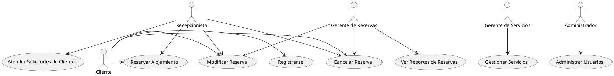

# Diagrama de Casos de Uso para Glamping

## Actores
- **Cliente**: Persona que busca hospedaje, servicios y experiencias.
- **Recepcionista**: Encargado de realizar reservaciones y atender al cliente.
- **Gerente de Servicios**: Responsable de gestionar todos los servicios ofrecidos.
- **Gerente de Reservas**: Maneja todas las reservas y disponibilidad.
- **Administrador**: Persona encargada de la gestión del sistema y la supervisión de personal.

## Principales Casos de Uso

### 1. **Reservar Alojamiento**
   - **Actor**: Cliente, Recepcionista
   - **Descripción**: Permite al Cliente reservar una habitación, cambiante según la disponibilidad.
   - **Precondición**: El Cliente debe estar registrado.
   - **Postcondición**: Se confirma la reserva.

### 2. **Registrarse**
   - **Actor**: Cliente
   - **Descripción**: Permite a un nuevo Cliente crear una cuenta.
   - **Precondición**: No debe existir un registro previo.
   - **Postcondición**: Cliente registrado.

### 3. **Modificar Reserva**
   - **Actor**: Cliente, Recepcionista, Gerente de Reservas
   - **Descripción**: Permite cambiar los detalles de una reserva existente.
   - **Precondición**: La reserva debe existir y estar en etapa editable.
   - **Postcondición**: Reserva modificada.

### 4. **Cancelar Reserva**
   - **Actor**: Cliente, Recepcionista, Gerente de Reservas
   - **Descripción**: Permite cancelar una reserva existente.
   - **Precondición**: La reserva debe existir.
   - **Postcondición**: Reserva cancelada y habitación disponible.

### 5. **Gestionar Servicios**
   - **Actor**: Gerente de Servicios
   - **Descripción**: Añadir, modificar o eliminar servicios ofrecidos en el Glamping.
   - **Precondición**: Debe tener permisos de gestión.
   - **Postcondición**: Servicios actualizados.

### 6. **Ver Reportes de Reservas**
   - **Actor**: Gerente de Reservas, Administrador
   - **Descripción**: Accede a informes de estadísticas de reservas.
   - **Precondición**: Debe tener acceso al sistema.
   - **Postcondición**: Reportes mostrados.

### 7. **Administrar Usuarios**
   - **Actor**: Administrador
   - **Descripción**: Añadir, modificar o eliminar usuarios del sistema.
   - **Precondición**: Debe tener privilegios de administrador.
   - **Postcondición**: Usuarios gestionados.

### 8. **Atender Solicitudes de Clientes**
   - **Actor**: Recepcionista
   - **Descripción**: Asistir a los clientes con sus dudas y solicitudes.
   - **Precondición**: Cliente presente.
   - **Postcondición**: Solicitud atendida.

## Diagrama de Casos de Uso

A continuación se puede agregar un diagrama visual que ilustre las relaciones entre los actores y los casos de uso, utilizando herramientas como UML.

